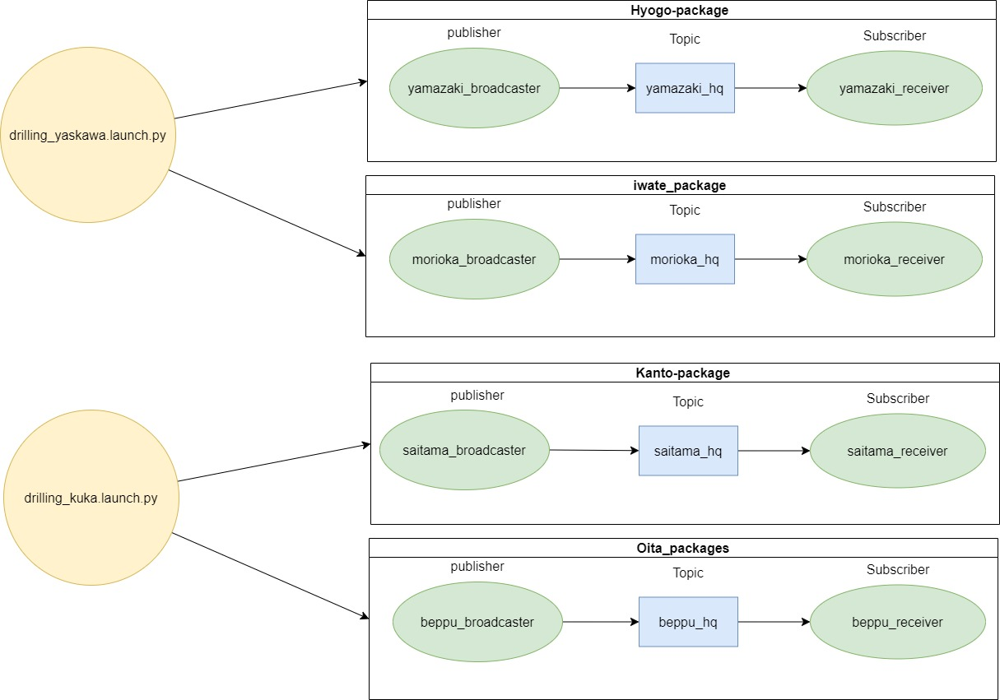

# ROS2 Launch File Parameter Tool 
A simple CLI tool to manage and validate parameters in ROS2 launch files

## Features

- List all parameters from a given launch file. 
- Validate if a parameter exists in a launch file.

## Prerequisites
- Python 3.x
- ROS2 Foxy or Humble
- (Any other dependencies or requirements)

## Installation

1. Clone this repository 

`git clone [repository_url]`

2. Navigate to the directory and install the requirements:

`cd [repository_name]`
`$ pip install -r requirements.txt`

## Usage
### List Parameters from a Launch File
`python3 cli_tool.py list_params [path_to_launch_file]`

### Validate a Parameter in a Launch File 
`python cli_tool.py validate_param [parameter_name] [path_to_launch_file]`

## Contribute
Please use this code in your own projects and raise issue/make PR's. It would be great to have more eyes on this problem. 

## Testnodes setup

